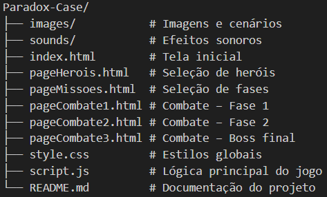

## 🎮Paradox-Case

Paradox-Case é um mini-jogo de combate por turnos desenvolvido inteiramente em Front-end (HTML, CSS e JavaScript), inspirado em RPGs clássicos e utilizando a DnD 5e API como fonte de dados para monstros.

O projeto tem como foco a integração com uma API pública, manipulação de JSON, aplicação de lógica de combate por turnos (rolagem de dados, dano, cura e condições especiais) e a construção de uma interface funcional e intuitiva.

## 🎮Execução local

Clone o repositório:

git clone https://github.com/caiomartins8/Paradox-Case.git

Abra o arquivo index.html em um navegador
ou utilize uma extensão de servidor local (ex: Live Server)

O projeto não necessita de instalação de dependências.

## 🎮Como Jogar

Ao iniciar o jogo, informe seu nome.

Escolha um herói, analisando cuidadosamente suas habilidades.
Após a seleção, o herói ficará vinculado à sua sessão.
Acesse a página de missões.
Caso tente entrar sem escolher um herói, um aviso será exibido.
Selecione a fase disponível.

Cada fase exige derrotar uma quantidade específica de inimigos.
Clique em Gerar Inimigo para iniciar um combate.
Sistema de Dados e Bônus
Após gerar o inimigo, o jogador deve rolar o dado:

1 a 2 → nenhum bônus
3 a 8 → bônus de 10% (ataque ou cura)
9 a 17 → bônus de 15% (ataque ou cura)
18 a 20 → bônus de 35%

O bônus pode ser aplicado estrategicamente em:
Ataque , Cura e Ataque crítico .
O ataque crítico possui cooldown de 1 turno após ser utilizado.
O jogo funciona em rodadas alternadas.
O turno do jogador utiliza o sistema de dados.
O turno do inimigo é automático e não utiliza o dado.
O botão Gerar Inimigo permanece ativo, pois os inimigos são gerados de forma aleatória através da API.

Cada monstro derrotado concede:
50 gold
60 XP
A cada 100 XP, o jogador sobe 1 nível.

Pântano → derrotar 3 inimigos
Masmorras → derrotar 5 inimigos
Topo do Castelo → enfrentar o boss final

Boss Final
Arakh, o Asceta do Vazio
Possui habilidades especiais
Ao atingir 50% de HP:
Bloqueia o ataque crítico do jogador
Após ser derrotado:
Retorna com 20% de vida
Possui prioridade para um último ataque
Ao vencer, o jogador é redirecionado para a tela inicial .

## 🎮 API como Fonte de Dados

Os inimigos são obtidos dinamicamente através da DnD 5e API, permitindo variedade de desafios sem a necessidade de alterar o código local.

Essa abordagem:

Garante inimigos aleatórios
Aumenta a rejogabilidade
Facilita futuras integrações com back-end
Demonstra consumo real de API REST

## 🎮Endpoints Utilizados (DnD 5e API)

Base URL:

https://www.dnd5eapi.co/api

Endpoints utilizados:

Endpoint	            Método	            Descrição
/monsters	             GET      	 Retorna a lista de monstros
/monsters/{index}	     GET	 Retorna detalhes completos de um monstro

## 🎮Dados consumidos:

Nome

Hit Points (hit_points)

Armor Class (armor_class)

Ações (actions)

Dados de dano (damage_dice)

Bônus de ataque (attack_bonus)

Fallbacks são aplicados quando algum dado não está disponível.

## 🎮Decisões de Projeto

Projeto desenvolvido apenas em Front-end, conforme escopo proposto

Lógica organizada por funções dentro do script.js

Sistema de combate inspirado em D&D, adaptado para melhor jogabilidade

Interface dividida em múltiplas telas para organização visual

Uso de modais para feedback de vitória e derrota

Tratamento de Erros

Uso de try/catch em requisições HTTP

Validação de respostas da API

Mensagens amigáveis ao usuário em caso de falha

## 🎮Organização de Arquivos

-------------